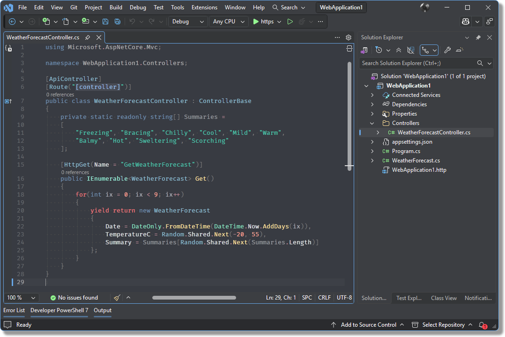

<h1 align="center">
  
   
  Goodnight Theme
</h1>

Goodnight Theme brings a moonlit palette to Visual Studio, blending soft night-sky grays with cool structural hues and gentle warm highlights in a polished dark theme designed for comfortable long coding sessions.

[![stars][stars-img]][stars-url]
[![latest][latest-img]][latest-url]
[![installs][installs-img]][installs-url]
[![issues][issues-img]][issues-url]
[![license][license-img]][license-url]

## 🚀 Installation

**Recommended:** Install the latest version for free from the [Visual Studio Marketplace](https://marketplace.visualstudio.com/items?itemName=wuoyrd.goodnight).

> [!TIP]
> **Need an older version?** Previous `.vsix` builds can be found on the [GitHub Releases page](https://github.com/wuoyrd/vs-theme-goodnight/releases). These are mainly provided for older Visual Studio versions that may not be supported by the latest Marketplace release.

## 🛠️ Contributing

Found something strange? Please [open an issue](https://github.com/wuoyrd/vs-theme-goodnight/issues).

Enjoying the theme? A kind word, a star, or a coffee are all appreciated: [buy me a coffee](https://buymeacoffee.com/wuoyrd).

## 📄 License

This theme is licensed under the [MIT License](./LICENSE).

[stars-url]: https://github.com/wuoyrd/vs-theme-goodnight/stargazers
[stars-img]: https://img.shields.io/github/stars/wuoyrd/vs-theme-goodnight?style=flat&colorA=3C3E42&colorB=CA98EB
[latest-url]: https://github.com/wuoyrd/vs-theme-goodnight/releases/latest
[latest-img]: https://vsmarketplacebadges.dev/version-short/wuoyrd.goodnight.svg?label=latest&colorA=3C3E42&colorB=57A6E6
[installs-url]: https://marketplace.visualstudio.com/items?itemName=wuoyrd.goodnight
[installs-img]: https://vsmarketplacebadges.dev/installs-short/wuoyrd.goodnight.svg?colorA=3C3E42&colorB=2BBC8A
[issues-url]: https://github.com/wuoyrd/vs-theme-goodnight/issues
[issues-img]: https://img.shields.io/github/issues/wuoyrd/vs-theme-goodnight.svg?colorA=3C3E42&colorB=FF976b
[license-url]: https://github.com/wuoyrd/vs-theme-goodnight/blob/main/LICENSE
[license-img]: https://img.shields.io/github/license/wuoyrd/vs-theme-goodnight?colorA=3C3E42&colorB=EB525F
